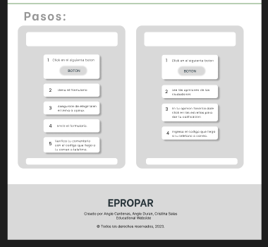
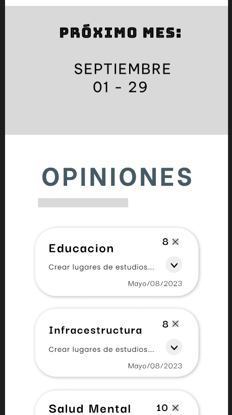

# EPROPAR (Entidad de progreso participativo)
Angie Nathalia Cardenas - 
Angie Tatiana Duran - 
Cristina Jerez

## Introducción:

<em>EPROPAR</em> es una iniciativa sin ánimo de lucro, que actua como intermediario entre los ciudadanos y los entes gubernamentales, permitiendo a la comunidad expresar sus opiniones y preocupaciones sobre cuestiones cruciales.

A través de los años se ha evidenciado un abandono por parte del gobierno en algunas zonas vulnerables de Colombia como lo es en la región del pacífico. Especificamente en el departamento del Chocó, en la cual persiste la desigualdad en la ayuda de recursos económicos, educativos, sociales y de vivienda que se brinda por parte del gobierno colombiano.

Basados en la información recolectada por el DANE del 2019-2020 en su totalidad de 10 ciudades del Chocó  donde se recoge un análisis de temas como el alojamiento y servicios de comida, construcción, industria manufacturera, entre otros. Evidenciando una falta de comunicación entre los ciudadanos de esta región y las entidades, fundaciones u organizaciones vinculadas a la ayuda social.

Por tal motivo, esta plataforma innovadora se enfoca en empoderar a la comunidad y fomentar la participación activa en la toma de decisiones locales.

Gracias a la información tomada del periodico colombiano El Nuevo Siglo se decidió seleccionar al municipio de Alto Baudó, localizado en el departamento del Choco con una tasa de incidencia de pobreza del 90,6% ubicandose en el tercer puesto según lo indicado en el reporte del DANE.

# Objetivo:

Mediante este proyecto se quiere fortalecer y notificar los principales problemas que presentan la población mayoritaria en el departamento del Chocó, Alto Baudó. Para ello hacemos uso de las tic donde se plantea la creación de una página web que almacene los problemas más cotidianos e importantes de este sector. Estructurando  y organizando la informacion de manera clara y precisa para generar un mayor entendimiento de los datos recolectados para las organizaciones.

La comunidad de Alto Baudo tendra la posibilidad de expresar a las entidades sus principales problemas a solucionar, y por parte de las organizadores se obtendria y manejaria la base de datos que se recolecta de manera optimizada y directa, las cuales mejorarian la ejecucion de los planes de accion por parte de los entes.

## Características Clave de la Plataforma: 

1. **Formulario de Opinión**: Los ciudadanos pueden compartir sus opiniones a través de un formulario en línea, proporcionando detalles y contexto sobre sus preocupaciones y sugerencias, pues el formulario incluye categorías predefinidas para que los usuarios seleccionen el tema al que se refiere su opinión (Educación, Salud Mental, Infraestructura, Alimentación, Seguridad, entre otros).

2. **Sección de Calificación de Opiniones**: Los vecinos pueden calificar las opiniones compartidas por otros ciudadanos. Esta función promueve la calidad y la relevancia de las opiniones presentadas. Las opiniones con las calificaciones más altas son destacadas y consideradas para recibir apoyo de los entes gubernamentales.

3. **Sección de Conócenos**: <em>EPROPAR</em> presenta información sobre su misión, visión y el equipo detrás de esta entidad, resaltando su enfoque en la participación ciudadana y el desarrollo comunitario.

4. **Sección Principal**: La página principal contiene información relevante sobre los temas más destacados del mes, las opiniones mejor calificadas y los proyectos respaldados por <em>EPROPAR</em>. También se incluyen noticias, eventos y actualizaciones relacionadas con el trabajo de la entidad.

5. **Proceso de Selección Mensual**: Cada mes, se seleccionan tres opiniones ganadoras en las categorías de Educación, Salud Mental, Infraestructura, Alimentación y Seguridad. Estas selecciones se basan en las calificaciones de los usuarios. Las opiniones ganadoras reciben apoyo económico, con el 50% del fondo destinado a la opinión más votada y el 25% para las dos siguientes con mayor votación. Este enfoque democrático fomenta la participación activa y el compromiso de la comunidad en la resolución de problemas locales.

### Tecnologias relevantes

- Diseño de interfaz usuario UI / Experiencia usuario UX
- Metodologia de recoleccion de datos
- HTML / CSS
- Framework
- Figma

## Conclusiones: 

La plataforma <em>EPROPAR</em> es una solución innovadora que promueve la participación ciudadana y la colaboración con entidades gubernamentales en el Chocó. Con su enfoque en la recolección y calificación de opiniones, así como el apoyo financiero a iniciativas destacadas, se posiciona como un modelo ejemplar de cómo las tecnologías digitales pueden fortalecer la democracia y el progreso local. Con su espíritu sin ánimo de lucro y su compromiso con las cuestiones más apremiantes de la comunidad, <em>EPROPAR</em> demuestra el poder transformador de la participación ciudadana.

## Diseños:

Modelo Desktop
==

En esta sección principal se puede evidenciar los ganadores mensuales como se había dicho en el punto 5 de las <em>características clave de la plataforma</em>. Podemos ver el header que indica el principal objetivo de la página y un título prometedor,también esta el nav como barra superior con tres secciones o sub-páginas y a la izquierda el logo de nuestra entidad. En esa misma página se ven las proximas fechas para que los ciudadanos sigan participando opinando y calificando,también se ven las opiniones principales y por último, la indicación de pasos para que los ciudadanos se puedan guiar mejor y participar activamente de la mejor forma.

Esta es una sub-página para que todos vean las opiniones de otras personas y puedan elegir con cual estan de acuerdo y darle "me gusta", para que sea esa sección (según el tema) el ganador mensual.

Acá se pueden evidenciar dos sub-paginas, la primera es para agregar la opinión que el ciudadano va aportar y se llena un formulario para la respectiva opinión.

Y la segunda sub-pagina es para darnos a conocer como entidad, nuestro propósito, el proceso de selección y las entidades, empresas o fundaciones con las que trabajamos, además de proporcionar nuestro contacto para mayor información o en para dar lugar a casos extraordinarios.

Modelo Mobile
==

Sección que se dio a mostrar anteriormente es del inicio de la página, versión más pequeña, practicamente la descripción de las imágenes es la misma información de un modelo desktop.

Sección formulario.

Sección de puntaje por medio de "likes".

Sección informativa y representativa.

### Fuentes Utilizadas: 

- [DANE (Departamento Administrativo Nacional de Estadística)](https://www.dane.gov.co/): Datos demográficos y estadísticas relevantes para comprender la situación en la región del Chocó.
- [El Nuevo Siglo](https://www.elnuevosiglo.com.co/): Fuente de noticias y análisis que proporciona información actualizada sobre asuntos locales y nacionales.
